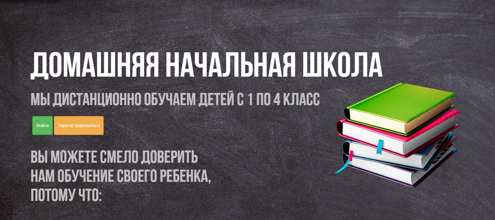

# Площадка для онлайн школы
_(проект был выполнен в 10 классе)_

### Проект представляет собой сайт, в котором можно:
- зарегистрироваться или войти в свой личный кабинет
- выбрать урок и изучить его

### При создании проекта использовались:
- flask - фреймворк для создания веб-приложений
- SQLAlchemy
